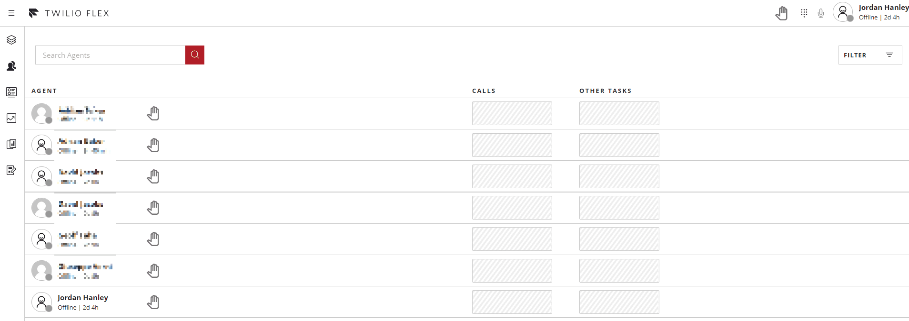

# Worker Hand Plugin
This plugin adds the ability for an agent to raise thier hand to gain the attention of the supervisors on the supervisor panel. The supervisor also has the ability to lower the agents hand.



This plugin was built in my 2 part blog post (https://jords1987.github.io/), please read for further information on how to build your  own version.

## Get up and running
Make sure you have [Node.js](https://nodejs.org) as well as [`npm`](https://npmjs.com). Twilio CLI supports Node >= 10.12 (and recommend the _even_ versions of Node).

1. Install the Twilio CLI following the instruction on the [Twilio CLI Quickstart
](https://www.twilio.com/docs/twilio-cli/quickstart)
2. Install the Flex Plugin CLI following the instructions on the [Install Flex Plugins CLI
](https://www.twilio.com/docs/flex/developer/plugins/cli/install)
3. Install dependencies 
```bash
npm install 
```
4. Select (or add) your Twilio Flex project to the Twilio CLI 
```bash
$ twilio profiles:use
```
5. Deploy the plugin 
```bash 
$ twilio flex:plugins:deploy 
```
6. Follow the instructions provided by the `deploy` command to create a release
